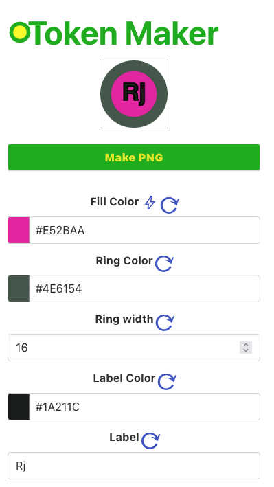
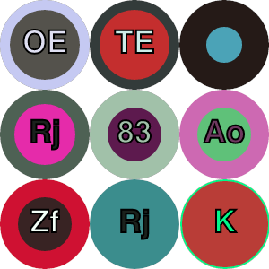

# TokenMaker

## Description

token_svg is a small web application designed to generate generic round tokens in PNG format. These 100px x 100px tokens, can be used for virtual tabletops (VTTs) like [owlbear rodeo](http://owlbear.app), or anything else. The motivation behind creating this project was to fulfill the need for quickly creating visually distinct tokens on the fly for owlbear.

You can access the application [here](https://nephlm.github.io/token_svg/index.html).

## Features

The TokenMaker app has the following features:

- Creation of generic round tokens
- Fill color (center), ring color, and text color can be changed independently
- The text on the token can be 0-2 characters long
- The ring size can go from 0px to completely filling the token

## User Interface

The following screenshot shows the application's user interface:

From my linux and windows machines, I can drag the generated token onto owlbear rodeo, but from my mac I must save the image and drag it from the finder.

## Examples

Here are a few examples of the tokens generated by the application:

## Functionality

The key functionalities of the token_svg application are as follows:

- All values can be randomly or manually set to customize the tokens.
- The application includes code to generate complementary colors between the fill color and the ring/label color. This helps in finding visually distinct color combinations, although it is relatively basic.
- The application is entirely frontend-based and does not require a backend. It utilizes JavaScript libraries hosted on content delivery networks (CDNs). You can download the HTML page and run it locally, but internet access is necessary, at least for the initial page load.

Feel free to explore and use the TokenMaker to create your own tokens. Enjoy!

## Implementation Details

The page generates code for vector-based .svg files, writes them to a canvas and then extracts from the canvas as a .png file.  It would be nice if owlbear rodeo could read .svg files, then we wouldn't have to do the conversion and could use vector based rather than bitmapped images.  

